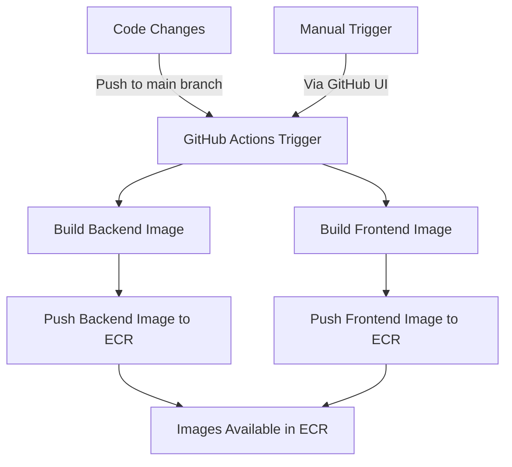

# CI/CD Workflow for CRPC

This document outlines the Continuous Integration and Continuous Deployment (CI/CD) workflow for the Conversational Resume & Portfolio Chatbot.

## Workflow Diagram

## Process Description

1. **Trigger**: The workflow is triggered by either:
   - Pushing code to the main branch
   - Manually starting the workflow via GitHub Actions UI

2. **Build Phase**:
   - The backend Docker image is built using the Dockerfile in the `backend/` directory
   - The frontend Docker image is built using the Dockerfile in the `frontend/` directory
   - Each image is tagged with both the commit SHA and `latest`

3. **Push Phase**:
   - The built images are pushed to their respective Amazon ECR repositories
   - Authentication to ECR is handled via GitHub Secrets

4. **Deployment**:
   - The images in ECR are now available for deployment
   - Actual deployment to ECS, EKS, or other services is handled separately

## Security Considerations

- AWS credentials are stored as GitHub Secrets
- The IAM user has minimal permissions required for ECR operations
- No sensitive information is included in the Docker images 